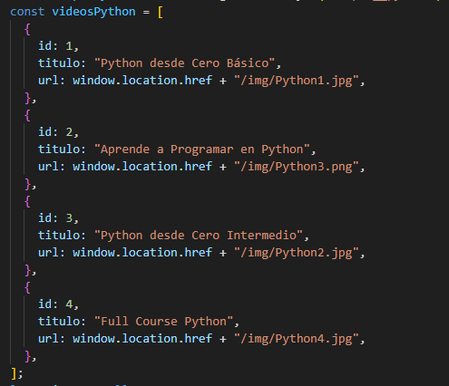
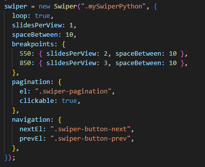

En la tercera y penúltima clase de la semana de InmersiónDEV de AluraLatam, se dejaron **5 desafíos** los cuales he realizado por completo. En la clase se trabajo con arrays y renderizar elementos en pantalla usando javascript. Los elementos en pantalla fueron imagenes y las URLs de dichas imagenes se almacenaban en un array. En base a lo anterior, se dejaron los siguientes desafíos:

1-Elige tu tema favorito para adaptar a nuestro código, es decir, en lugar de películas, puede ser una lista de animes, cómics, cursos, capas de juegos, entre otros

2-Intenta implementar otras versiones de la estructura de repetición que hicimos con for, como por ejemplo cambiar el for por el while

3-Crear una segunda lista para agregar los nombres de las películas abajo de las imágenes

4-Crea una condición para no agregar películas repetidas, en caso de que ya hayan sido agregadas anteriormente

5-Crea un campo y un botón para agregar la imagen a través de la pantalla, y no directamente en el código.

## Resolución Desafío 1

Utilizando mi conocimiento adquirido hasta ahora quise enriquecer el proyecto utilizando HTML, CSS y JavaScript algo más avanzado. Para empezar y respondiendo al primer desafío, he creado una página web de videos seleccionados de youtube para aprender a programar y por ahora tiene videos correspondientes al lenguaje de programación Python. A la página web la denominé como AluraTUBE. A continuación muestro la página completa:

Como se puede apreciar he creado un slider que permite desplazarse por las imagenes ya sea hacia la derecha o hacia la izquierda, de manera infinita. Para crear el slider he utilizando la librería **Swiper.js**.

## Resolución Desafío 2

He implementado un bucle **for-of** que me permite recorrer los elementos de un array en vez de sus indices como bien se puede hacer con un bucle for normal. A continuación muestro su uso:

Como se observa, recorro un array el cual he creado a partir de otro array sobre el cual utilizo el método map. Dicho bucle lo que hace es recorrer un array de objetos con datos de los videos el cual muestro a continuación:

## Resolución Desafío 3

Para resolver el desafío 3 no fue necesario crear una segunda lista ya que basta con crear un solo array de objetos y en cada objeto almaceno el titulo y la URL de los videos. Como mostre en la imagen anterior. Un array de objetos:

## Resolución Desafío 4

El cuarto desafío lo he resuelto posterior de crear los dos botones que se piden en el desafío 5. Al momento de agregar un video con un título ya existente en el array de objetos se muestra una alerta que he creado usando la librería SweetAlert2. A continuación muestro dicha alerta cuando se intenta agregar un video con un título que ya existe:

Además de esta alerta también he creado las alertas siguientes:

1-Alerta de Titulo Vacio que se muestra cuando se hace click en el botón Agregar Video y el campo título esta vacío:

2-Alerta cuando se selecciona en el botón llamado Seleccionar Imagen del Video un archivo que no es imagen del tipo jpeg, jpg, png y webp:

3-Alerta de Éxito cuando se agrega un video de manera exitosa:

El crear un nuevo video significa que el slider anterior se destruye para crear un nuevo objeto slider con las nuevas configuraciones ya sea nuevas slides. A continuación muestro el nuevo slider funcionando de manera perfecta:

Cada vez que agrego un nuevo video, destruyo el slider anterior (elimino el objeto slider anterior) y creo un nuevo objeto. A continuación muestro la función que realiza lo que acabo de mencionar:

Dicha función me borra el slider, borra los hijos del elemento contenedor del slider, actualiza la lista de objetos de videos y, por último, se renderiza el nuevo slider.

## Resolución Desafío 5

El desafío 5 como se puede observar ya fue resuelto como expliqué en la resolución del desafío 4. He creado un formulario exclusivo para agregar videos el cual es 100% responsivo y además cuando se carga una nueva imagen dicha imagen se muestra como un preview debajo del botón llamado Seleccionar Imagen del Video.

Por último y para finalizar, mi página web es 100% responsiva adecuándose el número de slides al tamaño de la pantalla tal y como puede observarse en el atributo breakpoints cuando creo el objeto Swiper:

Además, este proyecto me permitió desafiarme a mi mismo al utilizar una nueva librería que nunca habia utilizado antes la cual es Swiper.js. La página web de la [librería](https://swiperjs.com/get-started) presenta una sencilla introducción presentando ejemplos de diferentes tipos de sliders, en mi aplicación he utilizado el slider llamado [FreeMode](https://swiperjs.com/demos#freemode).
